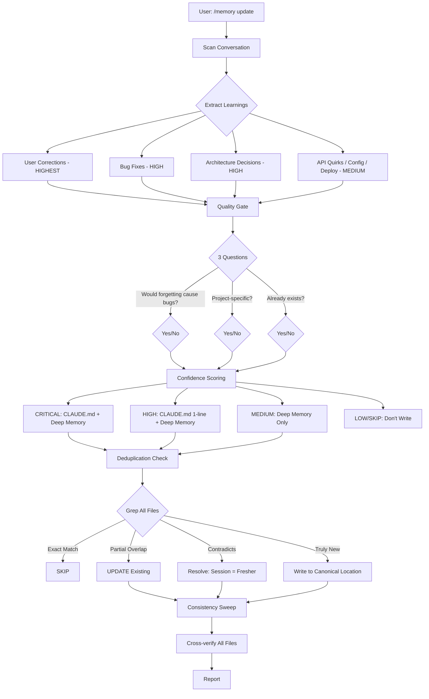

<p align="center">
  <h1 align="center">Claude Memory Skill</h1>
  <p align="center">
    <em>Persistent, self-healing project memory for Claude Code</em>
  </p>
</p>

<p align="center">
  <a href="#installation"></a>
  <a href="LICENSE"></a>
  <a href="#features"></a>
  <a href="#features"></a>
  <a href="#comparison"></a>
</p>

<p align="center">
  <a href="#features">Features</a> &bull;
  <a href="#how-it-works">How It Works</a> &bull;
  <a href="#installation">Installation</a> &bull;
  <a href="#usage">Usage</a> &bull;
  <a href="#comparison">Comparison</a>
</p>

---

## Install in 10 seconds

```bash
mkdir -p .claude/skills/memory && curl -o .claude/skills/memory/SKILL.md \
  https://raw.githubusercontent.com/timurceberda/claude-memory-skill/main/SKILL.md
```

Then restart Claude Code. Type `/memory status` to verify.

---

## The Problem

Claude Code loses context between sessions. Every new conversation starts from zero:

- Repeats the same mistakes you already corrected
- Forgets architecture decisions made 3 sessions ago
- Doesn't know which file owns which knowledge
- Memory files accumulate duplicates, contradictions, and stale entries
- CLAUDE.md bloats beyond usefulness

## The Solution

`/memory` is a skill that **learns from your corrections**, **maintains memory hygiene**, and **prevents knowledge rot** — automatically.

```
/memory update     Scan conversation, extract learnings, persist to memory layers
/memory prune      Find duplicates, contradictions, stale entries in all memory files
/memory reflect    Capture corrections and mistakes from the current session
/memory status     Quick health check of all memory files
```

Every learning goes through a **3-question quality gate**, **deduplication check**, and **consistency sweep** before being written.

---

## Features

<table>
<tr>
<td width="50%">

### What It Does

- 4 modes: `update` | `prune` | `reflect` | `status`
- 5-level confidence scoring (CRITICAL to SKIP)
- Deduplication across ALL memory files
- Contradiction detection (memory vs code)
- Stale entry detection (dead file refs, removed deps)
- Canonical Location Map (one source of truth per topic)
- Dynamic Context Injection (auto-discovers project layout)
- 4-layer memory hierarchy
- Anti-bloat rules with quality gate
- Consistency sweep after every edit
- CLAUDE.md health monitoring

</td>
<td width="50%">

### What It Doesn't Need

- 0 dependencies
- 0 API keys
- 0 configuration
- 0 build steps
- 0 external services
- No Docker, no npm, no database
- No vector DB, no embeddings
- Works with ANY project structure
- Single file installation

</td>
</tr>
</table>

---

## How It Works



---

## Memory Architecture

The skill auto-discovers your project's memory layout and works with whatever structure it finds:

```
Layer 1: CLAUDE.md                    Critical rules (read every session)
         |                            Max ~120 lines, 1-2 line summaries
         v
Layer 2: .serena/memories/*.md        Detailed context by topic
         OR docs/project_notes/       (auto-detected, one topic per file)
         OR memory-bank/
         |
         v
Layer 3: .claude/rules/*.md           File-pattern-specific rules
         |                            (activated by glob paths)
         v
Layer 4: Agent memories               Per-agent learning
                                      (auto-managed via memory: user)
```

**No hardcoded paths** — the skill uses Dynamic Context Injection (`!`command``) to discover your project layout at runtime.

---

## Installation

### One-liner (recommended)

```bash
mkdir -p .claude/skills/memory && curl -o .claude/skills/memory/SKILL.md \
  https://raw.githubusercontent.com/timurceberda/claude-memory-skill/main/SKILL.md
```

### Manual

1. Create directory: `mkdir -p .claude/skills/memory`
2. Copy `SKILL.md` into it
3. Restart Claude Code

### Verify

```
> /memory status
```

You should see a table of all detected memory files with line counts and health status.

---

## Usage

### `/memory update` — Learn from the current session

Run after productive sessions. Scans the conversation for valuable learnings:

```
> /memory update

Memory Update

### Extracted Learnings
| # | Learning                              | Level    | File                          |
|---|---------------------------------------|----------|-------------------------------|
| 1 | Cookie format requires space after ;  | CRITICAL | CLAUDE.md + known-gotchas.md  |
| 2 | user_tweets() returns promoted tweets | HIGH     | CLAUDE.md + twitter-source.md |
| 3 | Gemini needs "no Markdown" in prompt  | MEDIUM   | ai-integration.md             |

### Deduplication
- Skipped (already exists): "async everywhere" (in CLAUDE.md #4)
- Updated (merged): "Telegram HTML parse mode" (poster.py section)

Stats: +2 new | ~1 updated | -0 removed stale

/memory update complete
```

### `/memory prune` — Clean up memory

Find and fix issues in your memory files:

```
> /memory prune

Memory Health Report

### Duplicates
| # | Topic              | Found in              | Canonical          | Action      |
|---|--------------------|----------------------|--------------------|-----------  |
| 1 | Cookie format      | CLAUDE.md + gotchas  | known-gotchas.md   | Cross-ref   |

### Contradictions
| # | Claim              | File A       | File B          | Correct     |
|---|--------------------|-------------|-----------------|-------------|
| 1 | "Uses twikit"      | structure.md | CLAUDE.md       | twscrape    |

### Stale Entries
| # | Entry              | File         | Reason                    |
|---|--------------------|-------------|---------------------------|
| 1 | rss_source.py ref  | structure.md | File exists but unused    |

Total: 1 duplicate | 1 contradiction | 1 stale | 0 compactable

Apply fixes? (confirm which ones)
```

### `/memory reflect` — Capture corrections

Lightweight mode focused on user corrections:

```
> /memory reflect

Reflect: Learning from Corrections

### Corrections Found
1. [HIGH] "Don't use Markdown in Gemini prompt" -> written to ai-integration.md
2. [HIGH] "Filter promoted tweets by username" -> written to twitter-source.md

Found: 3 | Written: 2 | Skipped (dupes): 1

/memory reflect complete
```

### `/memory status` — Health overview

```
> /memory status

Memory Status

| File                       | Lines | Entries | Modified   |
|---------------------------|-------|---------|------------|
| CLAUDE.md                 | 98    | 12      | 2025-01-15 |
| .serena/memories/gotchas  | 45    | 8       | 2025-01-14 |
| .serena/memories/arch     | 67    | 11      | 2025-01-13 |
| .claude/rules/security    | 23    | 4       | 2025-01-10 |

Total: 4 files | 233 lines | 35 entries
CLAUDE.md: 98/120 lines (OK)
Serena: present
```

---

## Key Design Decisions

| Decision | Why |
|----------|-----|
| **Skill, not Agent** | Skills see the current conversation. Agents are spawned as separate processes and can't access the chat history — critical for `/memory update` which scans the conversation. |
| **Dynamic Context Injection** | Shell commands in SKILL.md (`!`command``) execute before the prompt is processed. This auto-discovers your project layout — no hardcoded paths, works with any project. |
| **Canonical Location Map** | Each topic has ONE source of truth. All other files cross-reference it. This prevents the duplicate sprawl that plagues multi-file memory systems. |
| **Quality Gate before writing** | Three questions filter out 60-70% of potential entries. Prevents CLAUDE.md bloat. |
| **Edit, don't rewrite** | Surgical `Edit` tool changes preserve existing file structure. `Write` rewrites risk destroying manual content. |
| **Report before fix** | In prune mode, findings are shown first. Changes only happen after user confirmation. Prevents accidental data loss. |

---

## Unique Features (vs. competitors)

Based on analysis of 14+ Claude Code memory tools:

| Feature | /memory | claude-mem | claude-reflect | Pro Workflow | Cipher | napkin |
|---------|---------|-----------|----------------|-------------|--------|--------|
| Conversation scanning | Yes | Yes | Corrections only | Yes | No | Manual |
| Deduplication | Yes | No | Yes | No | No | No |
| **Contradiction detection** | **Yes** | No | No | No | No | No |
| **Stale entry detection** | **Yes** | No | No | No | No | No |
| **Canonical Location Map** | **Yes** | No | No | No | No | No |
| **Dynamic Context Injection** | **Yes** | No | No | No | No | No |
| Confidence scoring | Yes | No | Yes | Categories | No | No |
| Multi-layer hierarchy | 4 layers | 3 layers | 2 layers | 2 layers | 2 layers | 1 layer |
| Zero dependencies | Yes | No (Node.js) | Yes | Yes | No (Docker) | Yes |
| Works without Serena | Yes | N/A | Yes | Yes | N/A | Yes |
| Prune / cleanup mode | Yes | No | No | No | No | No |

**Bold** = features unique to `/memory` (no competitor has them).

---

## Compatibility

| Tool | Status |
|------|--------|
| Claude Code | Full support (designed for it) |
| Projects with Serena | Auto-detects `.serena/memories/` |
| Projects with CLAUDE.md only | Works with CLAUDE.md as primary storage |
| Projects with `.claude/rules/` | Auto-detects and uses conditional rules |
| Projects with `memory-bank/` | Auto-detects custom memory locations |
| Monorepo with multiple CLAUDE.md | Supports root + subdirectory hierarchy |

---

## Repository Structure

```
claude-memory-skill/
├── .gitignore          OS files
├── LICENSE             MIT
├── README.md           This file
├── assets/
│   └── (demo files)    Terminal demos
└── SKILL.md            THE skill file (this IS the product)
```

The entire product is **one file**: `SKILL.md`. Everything else is documentation.

---

## Contributing

1. Fork the repository
2. Edit `SKILL.md`
3. Test locally: copy to `.claude/skills/memory/SKILL.md` in any project
4. Restart Claude Code and run `/memory status` to verify
5. Submit a PR

### SKILL.md Structure

```yaml
---
name: memory                    # Skill identifier
description: |                  # Trigger patterns for routing
  ...
allowed-tools: Read, Write...   # Tools the skill can use
disable-model-invocation: true  # Runs in current conversation
---

# Sections:
# 1. Language Rule
# 2. Auto-Discovered Project Layout (DCI)
# 3. Memory Architecture (4 layers)
# 4. Meta-Rules (format, anti-bloat, quality gate)
# 5. Canonical Location Map
# 6. MODE: update (6-step process)
# 7. MODE: prune (6-step process)
# 8. MODE: reflect (correction capture)
# 9. MODE: status (health overview)
# 10. $ARGUMENTS Handling
# 11. Guidelines
```

---

## Acknowledgements

Inspired by research into best practices from:
- [claude-reflect](https://github.com/BayramAnnakov/claude-reflect) — correction capture, confidence scoring
- [napkin](https://github.com/blader/napkin) — minimalist scratchpad approach
- [Pro Workflow](https://github.com/rohitg00/pro-workflow) — self-correcting memory loops
- [claude-diary](https://github.com/rlancemartin/claude-diary) — three-tier observation/reflection/retrieval
- [claude-code-auto-memory](https://github.com/severity1/claude-code-auto-memory) — PostToolUse auto-sync
- [SomeStay07/code-review-agent](https://github.com/SomeStay07/code-review-agent) — single-file distribution pattern

---

## License

MIT License. See [LICENSE](LICENSE) for details.
