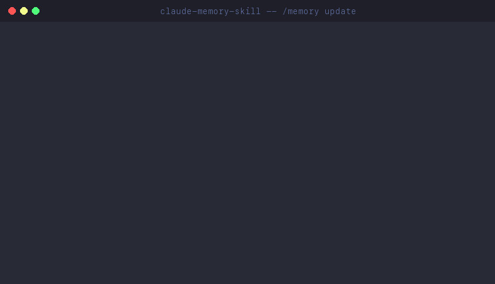
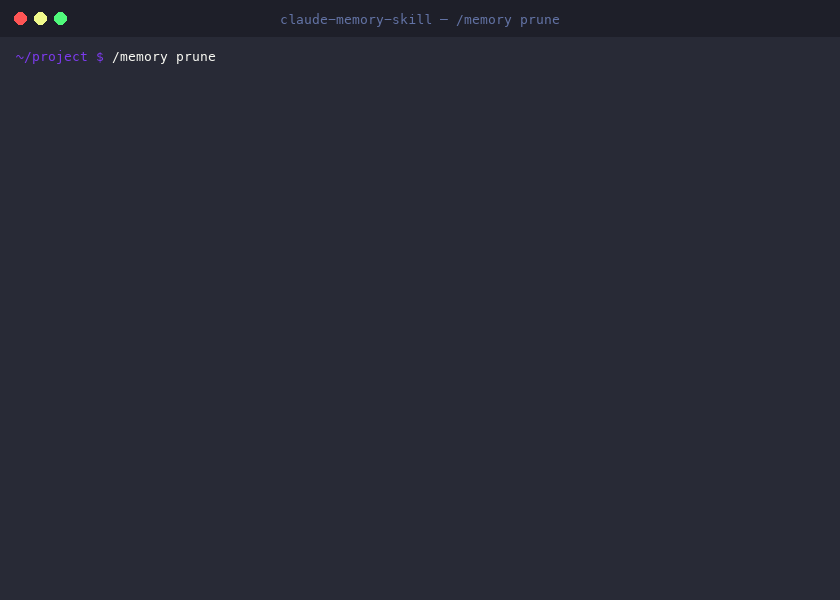
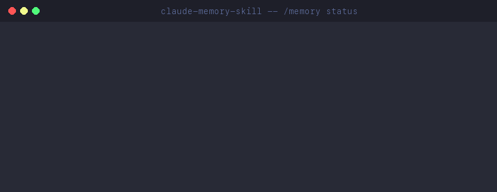

<div align="center">


# Claude Memory Skill

**Persistent project memory for Claude Code**

*One `.md` file — Claude learns from your corrections, catches contradictions in memory, and cleans up after itself*

[](https://code.claude.com/docs/en/skills)
[](LICENSE)
[]()
[]()
[]()
[](https://t.me/codeonvibes)

[Features](#features) · [How It Works](#how-it-works) · [Architecture](#memory-architecture) · [Demo](#demo) · [Installation](#installation) · [Usage](#usage-examples) · [Comparison](#comparison)

```bash
mkdir -p .claude/skills/memory && curl -o .claude/skills/memory/SKILL.md \
  https://raw.githubusercontent.com/SomeStay07/claude-memory-skill/main/SKILL.md
```

---

</div>

## The Problem

You finish a productive session with Claude Code. Bugs fixed, architecture decisions made, gotchas discovered. Next day — Claude starts from zero:

- Repeats the **same mistakes** you already corrected
- Forgets **architecture decisions** made 3 sessions ago
- Doesn't know **which file** owns which knowledge
- Memory files accumulate **duplicates, contradictions**, and stale entries
- CLAUDE.md **bloats** beyond usefulness — 500 lines of noise

## What This Does

**Claude Memory Skill** is a single `.md` file you drop into `.claude/skills/memory/`. [Skills](https://code.claude.com/docs/en/skills) are reusable prompt instructions that Claude Code loads on matching commands — like plugins, but zero-code. This one scans your conversations for corrections, bug fixes, and gotchas — deduplicates them against existing memory — and persists to your project files. No dependencies, no config.

```
/memory update     Scan conversation, extract learnings, persist to memory
/memory prune      Find duplicates, contradictions, stale entries
/memory reflect    Capture corrections and mistakes
/memory status     Quick health check of all memory files
```

Before writing anything, each learning passes a 3-question quality gate, dedup check against existing memory, and a consistency sweep across all files. See [Demo](#demo) for a walkthrough.

## At a Glance

<table>
<tr>
<td>

```
✅ 4 modes (update/prune/reflect/status)
✅ 5-level confidence scoring
✅ 5-layer memory hierarchy
✅ Auto-memory (~/.claude/projects/) support
✅ One topic → one file (no duplicates)
✅ Auto-discovers project layout at runtime
✅ Migration & test infra learning categories
✅ Anti-bloat quality gate
✅ 0 dependencies, 0 config
✅ 1 file — copy and use
✅ Responds in your language (EN, RU, etc.)
```

</td>
<td>

| Aspect | Manual `.md` files | `/memory` skill |
|:-------|:-----------------:|:---------------:|
| Deduplication | Manual | Automatic |
| Stale detection | None | Automatic |
| Contradiction check | Never | Every update |
| Canonical source | Ad-hoc | Enforced |
| CLAUDE.md bloat control | Hope | Quality gate |
| Time per update | 15+ min | 1 min |
| Consistency across files | Your memory | Auto-sweep |
| Setup time | — | 10 seconds |
| Cost | Free | Free |

</td>
</tr>
</table>

---

## Features

### Confidence Scoring

Every learning is classified before writing:

| Level | When to Write | Example | Where |
|:------|:-------------|:--------|:------|
| 🔴 **CRITICAL** | Forgetting causes crash / total failure | DB migration requires `--fake-initial` flag | CLAUDE.md + Layer 2 file |
| 🟡 **HIGH** | Causes wrong behavior, hard to debug | Rate limiter resets at UTC midnight, not local | CLAUDE.md (1-line) + Layer 2 |
| 🔵 **MEDIUM** | Saves significant time | ESLint needs flat config since v9 | Layer 2 only |
| ⚪ **LOW** | Nice-to-know, easily rediscovered | NPM cache location | Consider skipping |
| ⬛ **SKIP** | One-time, generic, or obvious | "Use async/await" | Don't write |

### Quality Gate

Three questions filter 60–70% of potential entries:

1. **Would forgetting this cause a bug or wasted time?** → No? Don't write
2. **Is this specific to THIS project?** → No? Don't write
3. **Does this already exist in memory?** → Yes? Update existing, don't create new

---

## How It Works

```
/memory update
│
├─ 1. Scan conversation for corrections, bug fixes, gotchas
├─ 2. Quality gate — 3 questions filter ~60% of noise
├─ 3. Classify by confidence (CRITICAL → HIGH → MEDIUM → SKIP)
├─ 4. Dedup — grep all memory files for exact/partial matches
│     ├─ Exact match? → skip
│     ├─ Partial overlap? → update existing entry
│     └─ Contradicts? → resolve (session data = fresher)
├─ 5. Write to canonical location (one topic → one file)
└─ 6. Consistency sweep — cross-verify all files agree
```

---

## Memory Architecture

Auto-discovers your project layout at startup. Works with whatever memory structure you already have:

```
Layer 1: CLAUDE.md                    Critical rules (read every session)
         │                            Max ~120 lines, 1-2 line summaries
         ▼
Layer 2: .serena/memories/*.md        Detailed context by topic
         OR docs/project_notes/       (auto-detected, one topic per file)
         OR memory-bank/
         │
         ▼
Layer 3: ~/.claude/projects/.../      Claude Code native auto-memory
         memory/MEMORY.md             (personal, local, loaded into system prompt)
         │
         ▼
Layer 4: .claude/rules/*.md           File-pattern-specific rules
         │                            (activated by glob paths)
         ▼
Layer 5: Agent memories               Per-agent learning
                                      (auto-managed by Claude Code)
```

**No hardcoded paths** — Dynamic Context Injection (`!command`) discovers your project layout at runtime.

---

## Demo

### `/memory update` — Learn from conversation

<div align="center">

</div>

### `/memory prune` — Find & fix issues

<div align="center">

</div>

### `/memory status` — Health overview

<div align="center">

</div>

---

## Installation

### One-liner (recommended)

```bash
mkdir -p .claude/skills/memory && curl -o .claude/skills/memory/SKILL.md \
  https://raw.githubusercontent.com/SomeStay07/claude-memory-skill/main/SKILL.md
```

### Manual

1. Create directory: `mkdir -p .claude/skills/memory`
2. Copy `SKILL.md` into it
3. Restart Claude Code

### Verify

```
> /memory status
```

You should see:

```
✅ CLAUDE.md detected (XX lines, YY entries)
✅ Memory layers auto-discovered
✅ /memory status works with no errors
```

---

## Usage Examples

### `/memory update` — After a productive session

```
> /memory update

Memory Update

### Extracted Learnings
| # | Learning                              | Level    | File                        |
|---|---------------------------------------|----------|-----------------------------|
| 1 | DB migration requires --fake-initial  | CRITICAL | CLAUDE.md + db-gotchas.md   |
| 2 | Rate limiter resets at UTC midnight   | HIGH     | CLAUDE.md + api-notes.md    |
| 3 | ESLint needs flat config since v9     | MEDIUM   | tooling.md                  |

### Deduplication
- Skipped (already exists): "use async/await for DB calls" (in CLAUDE.md #4)
- Updated (merged): "Redis connection pooling" (caching section)

Stats: +2 new | ~1 updated | -0 removed stale

/memory update complete
```

### `/memory prune` — Clean up memory files

```
> /memory prune

Memory Health Report

### Duplicates: 2 found
### Contradictions: 1 found (memory says "axios", code uses fetch)
### Stale: 1 entry references deleted file

Total: 2 duplicates | 1 contradiction | 1 stale | 0 compactable

Apply fixes? (confirm which ones)
```

### `/memory reflect` — Capture corrections only

```
> /memory reflect

Corrections Found:
1. [HIGH] "Cache TTL must be > 60s or it loops" → caching.md
2. [HIGH] "Auth token refresh needs force=true" → auth-notes.md

Found: 3 | Written: 2 | Skipped (dupes): 1
```

### Real-World Example: DI Framework Migration

After migrating a 85+ service DI container from tsyringe to a custom zero-dependency solution:

```
> /memory update

Memory Update

### Extracted Learnings
| # | Learning                                                          | Level    | File                          |
|---|-------------------------------------------------------------------|----------|-------------------------------|
| 1 | Global test setup mocks DI modules — tests needing real DI must  | CRITICAL | CLAUDE.md + testing-patterns  |
|   | use vi.unmock('@/lib/di/globals') before imports                  |          |                               |
| 2 | Composition root smoke test needs vi.unmock for service modules   | HIGH     | di-container + testing-patterns|
|   | that global setup mocks (CourseApiService, QuestionService)       |          |                               |
| 3 | ESLint no-undef doesn't recognize global .d.ts types —           | HIGH     | typescript-gotchas            |
|   | export/import types explicitly instead                            |          |                               |
| 4 | Pre-push hook CPU contention makes perf tests flaky —            | MEDIUM   | testing-patterns              |
|   | use 3x threshold for timing assertions                            |          |                               |

### Changes
- **CLAUDE.md**: Updated DI section (tsyringe → custom container)
- **di-container**: Added test suite docs (106 tests, 7 files)
- **testing-patterns**: Added DI mock patterns, vi.unmock guide
- **architecture-decisions**: Updated "Why Custom DI" rationale
- **Auto-memory**: Added Custom DI Container section to MEMORY.md

### Deduplication
- Updated (merged with existing): "DI mocking patterns" in testing-patterns
- Contradictions found & resolved: 1 (CLAUDE.md said "tsyringe", now "custom DI")

Stats: +8 new | ~5 updated | -3 removed stale (old tsyringe entries)

/memory update complete
```

---

## Key Design Decisions

| Decision | Why |
|:---------|:----|
| **Skill, not Agent** | Skills see the current conversation. Agents can't — critical for `/memory update` which scans the chat. |
| **Dynamic Context Injection** | `!command` in SKILL.md runs before prompt processing. Auto-discovers your project — no hardcoded paths. |
| **Canonical Location Map** | Each topic → ONE source of truth. Cross-references, not duplicates. Prevents sprawl. |
| **Quality Gate** | 3 questions filter 60–70% of entries. Prevents CLAUDE.md bloat. |
| **Edit, don't rewrite** | Surgical changes preserve existing structure. Full rewrites risk destroying manual content. |
| **Report before fix** | In prune mode: show findings first, fix after confirmation. No accidental data loss. |

---

## Comparison

Tested against 14+ Claude Code memory tools:

| Feature | /memory | claude-mem | claude-reflect | Pro Workflow | Cipher | napkin |
|:--------|:-------:|:---------:|:--------------:|:-----------:|:------:|:------:|
| Conversation scanning | ✅ | ✅ | Corrections | ✅ | ❌ | Manual |
| Deduplication | ✅ | ❌ | ✅ | ❌ | ❌ | ❌ |
| Contradiction detection | ✅ | ❌ | ❌ | ❌ | ❌ | ❌ |
| Stale entry detection | ✅ | ❌ | ❌ | ❌ | ❌ | ❌ |
| Canonical Location Map | ✅ | ❌ | ❌ | ❌ | ❌ | ❌ |
| Dynamic Context Injection | ✅ | ❌ | ❌ | ❌ | ❌ | ❌ |
| Confidence scoring | ✅ | ❌ | ✅ | Categories | ❌ | ❌ |
| Auto-memory support | ✅ | ❌ | ❌ | ❌ | ❌ | ❌ |
| Multi-layer hierarchy | 5 | 3 | 2 | 2 | 2 | 1 |
| Prune / cleanup mode | ✅ | ❌ | ❌ | ❌ | ❌ | ❌ |
| Zero dependencies | ✅ | ❌ | ✅ | ✅ | ❌ | ✅ |
| Setup time | 10 sec | 5 min | 10 sec | 30 sec | 10 min | 10 sec |
| Cost | Free | Free | Free | Free | Free | Free |

Rows with all ❌ except `/memory` = features no other tool has.

---

## Compatibility

| Environment | Status |
|:------------|:-------|
| Claude Code | ✅ Full support (designed for it) |
| Projects with Serena | ✅ Auto-detects `.serena/memories/` |
| Projects with CLAUDE.md only | ✅ Works with CLAUDE.md as primary storage |
| Projects with `.claude/rules/` | ✅ Auto-detects conditional rules |
| Projects with `memory-bank/` | ✅ Auto-detects custom locations |
| Claude Code auto-memory | ✅ Auto-detects `~/.claude/projects/.../memory/` |
| Monorepo (multiple CLAUDE.md) | ✅ Root + subdirectory hierarchy |

---

## Troubleshooting

| Issue | Fix |
|:------|:----|
| `/memory status` shows nothing | Restart Claude Code after installing SKILL.md |
| No memory files detected | Create a `CLAUDE.md` in your project root |
| Skill not recognized | Check file is at `.claude/skills/memory/SKILL.md` (exact path) |
| Changes not persisting | Verify Claude Code has write permission to project files |
| CLAUDE.md over limit | Run `/memory prune` to identify entries to compress |
| `/memory update` finds nothing | Normal — not every session has learnings worth saving |
| Auto-memory not detected | Path is derived from project dir hash. Run `/memory status` to see detected path |
| Auto-memory vs CLAUDE.md confusion | CLAUDE.md = git-tracked team rules. Auto-memory = local personal learnings |
| Secrets in memory files | The skill reads your conversation. Don't discuss API keys right before `/memory update` |

---

## Repository Structure

```
claude-memory-skill/
├── .gitignore              OS files
├── LICENSE                 MIT
├── README.md               This file
├── assets/
│   ├── logo.svg            Project logo
│   ├── demo-update.gif     /memory update animation
│   ├── demo-prune.gif      /memory prune animation
│   └── demo-status.gif     /memory status animation
└── SKILL.md                THE skill file (this IS the product)
```

The entire product is **one file**: `SKILL.md`. Everything else is documentation.

---

## Contributing

1. Fork the repository
2. Edit `SKILL.md`
3. Test locally: copy to `.claude/skills/memory/SKILL.md` in any project
4. Restart Claude Code, run `/memory status`
5. Submit a PR

### SKILL.md Internal Structure

```yaml
---
name: memory                    # Skill identifier
description: |                  # Trigger patterns for routing
  ...
allowed-tools: Read, Write...   # Tools the skill can use
disable-model-invocation: true  # Runs in current conversation
---

# Sections:
# 1. Language Rule
# 2. Auto-Discovered Project Layout (DCI)
# 3. Memory Architecture (5 layers)
# 4. Meta-Rules (format, anti-bloat, quality gate)
# 5. Canonical Location Map
# 6. MODE: update (6-step process)
# 7. MODE: prune (6-step process)
# 8. MODE: reflect (correction capture)
# 9. MODE: status (health overview)
# 10. $ARGUMENTS Handling
# 11. Guidelines
```

---

## Acknowledgements

Built after studying 14+ Claude Code memory tools. Key influences:
- [claude-reflect](https://github.com/BayramAnnakov/claude-reflect) — the idea of capturing user corrections as highest-priority learnings
- [napkin](https://github.com/blader/napkin) — proof that a scratchpad approach works; we added structure on top
- [claude-diary](https://github.com/rlancemartin/claude-diary) — three-tier observation/reflection model that shaped our layer hierarchy
- [code-review-agent](https://github.com/SomeStay07/code-review-agent) — single-file distribution pattern (one `.md` IS the product)

---

## See Also

**[Code Reviewer Agent](https://github.com/SomeStay07/code-review-agent)** — automated code review for Claude Code. 14 categories, OWASP security checks, auto-fix. Works well together: this skill remembers what matters, the reviewer catches what's broken.

## License

MIT License. See [LICENSE](LICENSE) for details.
