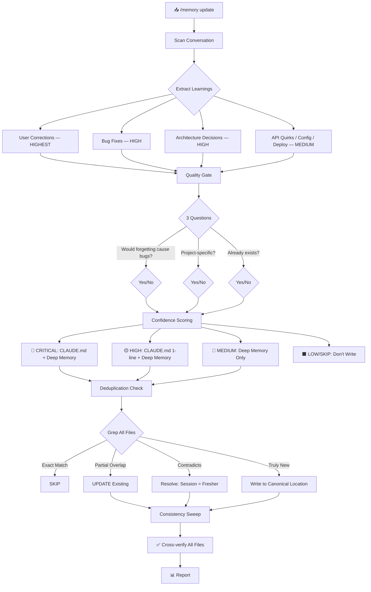

<div align="center">

# Claude Memory Skill

**Persistent, self-healing project memory for Claude Code**

*A Claude Code skill that learns from your corrections, detects contradictions, and prevents knowledge rot — automatically*

[](https://docs.anthropic.com/en/docs/agents)
[](LICENSE)
[]()
[]()
[]()
[](https://t.me/codeonvibes)

[Features](#features) · [How It Works](#how-it-works) · [Demo](#demo) · [Installation](#installation) · [Comparison](#vs-competitors)

```bash
mkdir -p .claude/skills/memory && curl -o .claude/skills/memory/SKILL.md \
  https://raw.githubusercontent.com/SomeStay07/claude-memory-skill/main/SKILL.md
```

---

</div>

## The Problem

You finish a productive session with Claude Code. Bugs fixed, architecture decisions made, gotchas discovered. Next day — Claude starts from zero:

- Repeats the **same mistakes** you already corrected
- Forgets **architecture decisions** made 3 sessions ago
- Doesn't know **which file** owns which knowledge
- Memory files accumulate **duplicates, contradictions**, and stale entries
- CLAUDE.md **bloats** beyond usefulness — 500 lines of noise

## The Solution

**Claude Memory Skill** is a `.md` file that gives Claude Code persistent, self-maintaining memory. It scans conversations for learnings and keeps your knowledge files clean.

```
/memory update     Scan conversation, extract learnings, persist to memory
/memory prune      Find duplicates, contradictions, stale entries
/memory reflect    Capture corrections and mistakes
/memory status     Quick health check of all memory files
```

Every learning goes through a **3-question quality gate**, **deduplication check**, and **consistency sweep** before being written.

<div align="center">
<br>

<br>
<sub>What /memory update looks like — real learnings, real dedup, no bloat</sub>
<br><br>
</div>

## Why This Skill

<table>
<tr>
<td>

```
✅ 4 modes (update/prune/reflect/status)
✅ 5-level confidence scoring
✅ Contradiction detection (memory vs code)
✅ Stale entry detection
✅ Canonical Location Map
✅ Dynamic Context Injection
✅ 4-layer memory hierarchy
✅ Anti-bloat quality gate
✅ 0 dependencies, 0 config
✅ 1 file — copy and use
✅ Bilingual (EN + RU)
```

</td>
<td>

| Aspect | Manual `.md` files | `/memory` skill |
|:-------|:-----------------:|:---------------:|
| Deduplication | Manual | Automatic |
| Stale detection | None | Automatic |
| Contradiction check | Never | Every update |
| Canonical source | Ad-hoc | Enforced |
| CLAUDE.md bloat control | Hope | Quality gate |
| Time per update | 15+ min | 1 min |
| Consistency across files | Your memory | Auto-sweep |
| Setup time | — | 10 seconds |
| Cost | Free | Free |

</td>
</tr>
</table>

---

## Features

### Confidence Scoring

Every learning is classified before writing:

| Level | When to Write | Example | Where |
|:------|:-------------|:--------|:------|
| 🔴 **CRITICAL** | Forgetting causes crash / total failure | Cookie format: SPACE after `;` | CLAUDE.md + deep memory |
| 🟡 **HIGH** | Causes wrong behavior, hard to debug | `user_tweets()` returns promoted content | CLAUDE.md (1-line) + deep memory |
| 🔵 **MEDIUM** | Saves significant time | Gemini needs "no Markdown" in prompt | Deep memory only |
| ⚪ **LOW** | Nice-to-know, easily rediscovered | NPM cache location | Consider skipping |
| ⬛ **SKIP** | One-time, generic, or obvious | "Use async/await" | Don't write |

### Quality Gate

Three questions filter 60–70% of potential entries:

1. **Would forgetting this cause a bug or wasted time?** → No? Don't write
2. **Is this specific to THIS project?** → No? Don't write
3. **Does this already exist in memory?** → Yes? Update existing, don't create new

---

## How It Works



---

## Memory Architecture

The skill auto-discovers your project's memory layout and works with whatever it finds:

```
Layer 1: CLAUDE.md                    Critical rules (read every session)
         │                            Max ~120 lines, 1-2 line summaries
         ▼
Layer 2: .serena/memories/*.md        Detailed context by topic
         OR docs/project_notes/       (auto-detected, one topic per file)
         OR memory-bank/
         │
         ▼
Layer 3: .claude/rules/*.md           File-pattern-specific rules
         │                            (activated by glob paths)
         ▼
Layer 4: Agent memories               Per-agent learning
                                      (auto-managed via memory: user)
```

**No hardcoded paths** — Dynamic Context Injection (`!`command``) discovers your project layout at runtime.

---

## Demo

### `/memory update` — Learn from conversation

<div align="center">

</div>

### `/memory prune` — Find & fix issues

<div align="center">

</div>

### `/memory status` — Health overview

<div align="center">

</div>

---

## Installation

### One-liner (recommended)

```bash
mkdir -p .claude/skills/memory && curl -o .claude/skills/memory/SKILL.md \
  https://raw.githubusercontent.com/SomeStay07/claude-memory-skill/main/SKILL.md
```

### Manual

1. Create directory: `mkdir -p .claude/skills/memory`
2. Copy `SKILL.md` into it
3. Restart Claude Code

### Verify

```
> /memory status
```

You should see:

```
✅ CLAUDE.md detected (XX lines, YY entries)
✅ Memory layers auto-discovered
✅ /memory status works with no errors
```

---

## Usage Examples

### `/memory update` — After a productive session

```
> /memory update

Memory Update

### Extracted Learnings
| # | Learning                              | Level    | File                          |
|---|---------------------------------------|----------|-------------------------------|
| 1 | Cookie format requires space after ;  | CRITICAL | CLAUDE.md + known-gotchas.md  |
| 2 | user_tweets() returns promoted tweets | HIGH     | CLAUDE.md + twitter-source.md |
| 3 | Gemini needs "no Markdown" in prompt  | MEDIUM   | ai-integration.md             |

### Deduplication
- Skipped (already exists): "async everywhere" (in CLAUDE.md #4)
- Updated (merged): "Telegram HTML parse mode" (poster.py section)

Stats: +2 new | ~1 updated | -0 removed stale

/memory update complete
```

### `/memory prune` — Clean up memory files

```
> /memory prune

Memory Health Report

### Duplicates: 2 found
### Contradictions: 1 found (memory says "twikit", code uses twscrape)
### Stale: 1 entry references removed file

Total: 2 duplicates | 1 contradiction | 1 stale | 0 compactable

Apply fixes? (confirm which ones)
```

### `/memory reflect` — Capture corrections only

```
> /memory reflect

Corrections Found:
1. [HIGH] "Don't use Markdown in Gemini prompt" → ai-integration.md
2. [HIGH] "Filter promoted tweets by username" → twitter-source.md

Found: 3 | Written: 2 | Skipped (dupes): 1
```

---

## Key Design Decisions

| Decision | Why |
|:---------|:----|
| **Skill, not Agent** | Skills see the current conversation. Agents can't — critical for `/memory update` which scans the chat. |
| **Dynamic Context Injection** | `!`command`` in SKILL.md runs before prompt processing. Auto-discovers your project — no hardcoded paths. |
| **Canonical Location Map** | Each topic → ONE source of truth. Cross-references, not duplicates. Prevents sprawl. |
| **Quality Gate** | 3 questions filter 60–70% of entries. Prevents CLAUDE.md bloat. |
| **Edit, don't rewrite** | Surgical changes preserve existing structure. Full rewrites risk destroying manual content. |
| **Report before fix** | In prune mode: show findings first, fix after confirmation. No accidental data loss. |

---

## Vs. Competitors

Based on analysis of 14+ Claude Code memory tools:

| Feature | /memory | claude-mem | claude-reflect | Pro Workflow | Cipher | napkin |
|:--------|:-------:|:---------:|:--------------:|:-----------:|:------:|:------:|
| Conversation scanning | ✅ | ✅ | Corrections | ✅ | ❌ | Manual |
| Deduplication | ✅ | ❌ | ✅ | ❌ | ❌ | ❌ |
| **Contradiction detection** | **✅** | ❌ | ❌ | ❌ | ❌ | ❌ |
| **Stale entry detection** | **✅** | ❌ | ❌ | ❌ | ❌ | ❌ |
| **Canonical Location Map** | **✅** | ❌ | ❌ | ❌ | ❌ | ❌ |
| **Dynamic Context Injection** | **✅** | ❌ | ❌ | ❌ | ❌ | ❌ |
| Confidence scoring | ✅ | ❌ | ✅ | Categories | ❌ | ❌ |
| Multi-layer hierarchy | 4 | 3 | 2 | 2 | 2 | 1 |
| Prune / cleanup mode | ✅ | ❌ | ❌ | ❌ | ❌ | ❌ |
| Zero dependencies | ✅ | ❌ | ✅ | ✅ | ❌ | ✅ |
| Setup time | 10 sec | 5 min | 10 sec | 30 sec | 10 min | 10 sec |
| Cost | Free | Free | Free | Free | Free | Free |

**Bold** = features unique to `/memory` (no competitor has them).

---

## Compatibility

| Environment | Status |
|:------------|:-------|
| Claude Code | ✅ Full support (designed for it) |
| Projects with Serena | ✅ Auto-detects `.serena/memories/` |
| Projects with CLAUDE.md only | ✅ Works with CLAUDE.md as primary storage |
| Projects with `.claude/rules/` | ✅ Auto-detects conditional rules |
| Projects with `memory-bank/` | ✅ Auto-detects custom locations |
| Monorepo (multiple CLAUDE.md) | ✅ Root + subdirectory hierarchy |

---

## Troubleshooting

| Issue | Fix |
|:------|:----|
| `/memory status` shows nothing | Restart Claude Code after installing SKILL.md |
| No memory files detected | Create a `CLAUDE.md` in your project root |
| Skill not recognized | Check file is at `.claude/skills/memory/SKILL.md` (exact path) |
| Changes not persisting | Verify Claude Code has write permission to project files |
| CLAUDE.md over limit | Run `/memory prune health` to identify entries to compress |

---

## Repository Structure

```
claude-memory-skill/
├── .gitignore              OS files
├── LICENSE                 MIT
├── README.md               This file
├── assets/
│   ├── demo-update.svg     /memory update animation
│   ├── demo-prune.svg      /memory prune animation
│   └── demo-status.svg     /memory status animation
└── SKILL.md                THE skill file (this IS the product)
```

The entire product is **one file**: `SKILL.md`. Everything else is documentation.

---

## Contributing

1. Fork the repository
2. Edit `SKILL.md`
3. Test locally: copy to `.claude/skills/memory/SKILL.md` in any project
4. Restart Claude Code, run `/memory status`
5. Submit a PR

### SKILL.md Internal Structure

```yaml
---
name: memory                    # Skill identifier
description: |                  # Trigger patterns for routing
  ...
allowed-tools: Read, Write...   # Tools the skill can use
disable-model-invocation: true  # Runs in current conversation
---

# Sections:
# 1. Language Rule
# 2. Auto-Discovered Project Layout (DCI)
# 3. Memory Architecture (4 layers)
# 4. Meta-Rules (format, anti-bloat, quality gate)
# 5. Canonical Location Map
# 6. MODE: update (6-step process)
# 7. MODE: prune (6-step process)
# 8. MODE: reflect (correction capture)
# 9. MODE: status (health overview)
# 10. $ARGUMENTS Handling
# 11. Guidelines
```

---

## Acknowledgements

Inspired by research into best practices from:
- [claude-reflect](https://github.com/BayramAnnakov/claude-reflect) — correction capture, confidence scoring
- [napkin](https://github.com/blader/napkin) — minimalist scratchpad approach
- [Pro Workflow](https://github.com/rohitg00/pro-workflow) — self-correcting memory loops
- [claude-diary](https://github.com/rlancemartin/claude-diary) — three-tier observation/reflection/retrieval
- [claude-code-auto-memory](https://github.com/severity1/claude-code-auto-memory) — PostToolUse auto-sync
- [code-review-agent](https://github.com/SomeStay07/code-review-agent) — single-file distribution pattern

---

## License

MIT License. See [LICENSE](LICENSE) for details.
